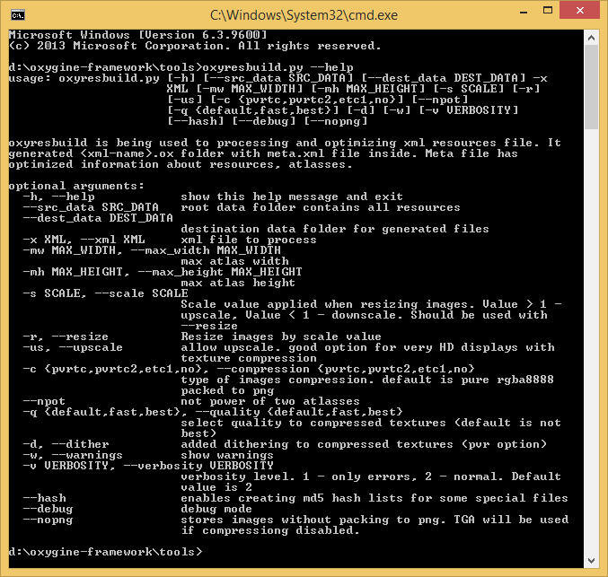

#Building Atlasses
Все изображения, объявленные в xml файле ресурсов в группе <atlas> автоматически собираются в атласы при загрузке xml. 
	
	<atlas>
	    <image file="close.png" />
	    <image file="button.png" />     
	    <image file="anim/run.png" />
	</atlas>

Можно существенно повысить скорость загрузки приложения и снизить использование памяти, если собрать атласы заранее, еще на этапе сборки игры.

Для этого в oxygine есть специальная командная утилита **"oxyresbuild"**, расположенная в папке tools:

	oxygine-framework/tools/oxyresbuild.py

Чтобы ее использовать потребуется дополнительно установить Python, читайте подробности:
		
[oxygine-framework/tools/readme.txt](https://bitbucket.org/oxygine/oxygine-framework/src/tip/tools/readme.txt?at=tip)

В examples/Game/Part5 есть примеры ее использования, смотрите shell скрипты. Например, 
examples/Game/part5/gen-atlasses.bat:

	python ../../../tools/oxyresbuild.py -x xmls/ui.xml --src_data data --dest_data data

результат его работы появится в папке:

	oxygine-framework/examples/Game/part5/data/ui.xml.ox/

Также, в Game/Part5 папка с исходными изображениями вынесена наружу из data, т.к они не нужны в финальной сборке приложения.

##HD Assets

Исходный арт обычно принято хранить в высоком разрешении, с запасом для HD экранов.
 
Допустим, художник взял за основу разрешение 2048х1536, а игра пока готовится для дисплеев размерностью 1024x768.
Художник прислал задний фон, который нужно вставить в игре, мы добавили его в наш resources.xml файл:

	<atlas>
	    <image file="background.png" />
	</atlas> 

Теперь создадим его:

	spSprite sprite = new Sprite;
	sprite->setResAnim(res.getResAnim("background"));
	sprite->attachTo(getStage());

Спрайт вылезет за границы экрана, потому необходимо уменьшить его:

	float scaleFactor = 1024.0f / 2048.0f; // =0.5f
	/* or
	float scaleFactor = getStage()->getWidth() / (float)sprite->getWidth()	
	*/
	sprite->setScale(scaleFactor);

Аналогичные вызовы *setScale* придется делать для каждого созданного спрайта, который хранится в высоком разрешении. Но можно поступить проще и указать в xml заранее необходимый scale_factor

	<set scale_factor = "0.5f" />

 	<atlas>
	    <image file="background.png" />
	</atlas>

И таким образом код упростится до изначального: 
	
	spSprite sprite = new Sprite;
	sprite->setResAnim(res.getResAnim("background"));
	sprite->attachTo(getStage());

а sprite будет иметь требуемую "виртуальную" размерность, равную 1024x768 и полностью поместится на экране:

	sprite->getWidth () == 1024
	sprite->getHeight() == 768 

Но в оперативной памяти картинка до сих пор будет иметь размеры 2048х1536 и занимать лишнюю память, потому сгенерируем атлас для xml с помощью *oxyresbuild* с аргументом **-r**:

	python path/to/oxyresbuild/oxyresbuild.py -x resources.xml --src_data data --dest_data data -r

**-r** - это сокращение от **--resize**, обозначающее что перед сборкой атласа изображения нужно отмасштабировать в соответствии с установленным scale_factor. Таким образом в атлас попадет изображение уменьшенное в 2 раза.

Можно еще снизить размер изображение в атласе, добавив аргумент **-s**:

	python path/to/oxyresbuild/oxyresbuild.py -x resources.xml --src_data data --dest_data data -r -s 0.625

**-s** - сокращение от **--scale**, равное 0.625 говорит, что изображения перед упаковкой в атласы нужно дополнительно отмасштабировать на 0.625. Таким образом, в атлас попадет картинка размерами

	w = 2048 * 0.5 * 0.625 = 640
	h = 1536 * 0.5 * 0.625 = 480

Но, "виртуальные" ее размеры от этого не изменяться и будут равны, как и раньше:

	sprite->getWidth () == 1024
	sprite->getHeight() == 768 

Можно, наоборот, повысить размер в атласе, выставив **-s** > 1:
	
	python path/to/oxyresbuild/oxyresbuild.py -x resources.xml --src_data data --dest_data data -r -s 1.25 

Таким образом, в атлас попадет картинка размерами

	w = 2048 * 0.5 * 1.25 = 1280
	h = 1536 * 0.5 * 1.25 = 960

